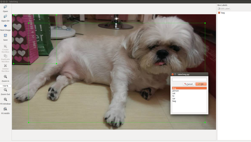
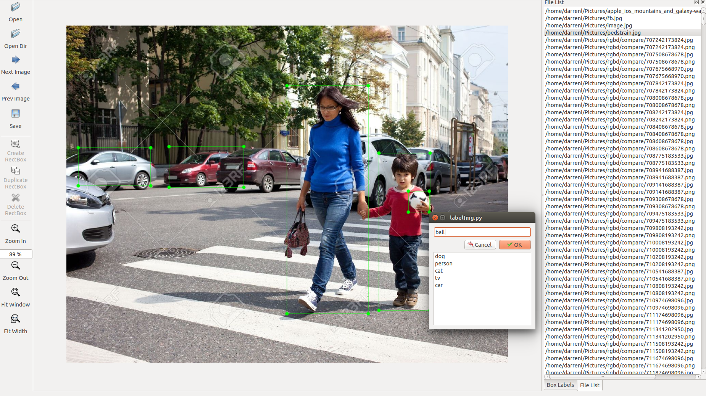

# LabelImg

### Updates

- Solve `jpg` supporting for `py2-qt4` branch in Windows by adding [`plugins`](https://github.com/GreenKing/labelImg/blob/py2-qt4/labelImg.py#L17).
- Add `auto save` while toggle to previous image.
- Add `Simgle Class Mode` to speed up annotation.
- Add `openPrevImg` and `openNextImg` action to advanced mode.
- Add `Change default save dir` to tool bar.
- Fix crash bug while choosing a point to delete.

LabelImg is a graphical image annotation tool.

It is written in Python and uses Qt for its graphical interface.

The annotation file will be saved as an XML file. The annotation format is PASCAL VOC format, and the format is the same as [ImageNet](http://www.image-net.org/)

## Build source and use it

Linux/Ubuntu/Mac requires at least [Python 2.6](http://www.python.org/getit/) and has been tested with [PyQt
4.8](http://www.riverbankcomputing.co.uk/software/pyqt/intro).

In order to build the resource and assets, you need to install pyqt4-dev-tools and lxml:

### Ubuntu

    sudo apt-get install pyqt4-dev-tools
    sudo pip install lxml
    make all
    ./labelImg.py

### OS X

    brew install qt qt4
    brew install libxml2
    make all
    ./labelImg.py

### Windows

Need to download and setup [Python 2.6](https://www.python.org/downloads/windows/) or later and [PyQt4](https://www.riverbankcomputing.com/software/pyqt/download). Also, you need to install lxml.

Open cmd and go to [labelImg]

    pyrcc4 -o resources.py resources.qrc
    python labelImg.py

## Download the prebuilt binary directly
[http://tzutalin.github.io/labelImg/](http://tzutalin.github.io/labelImg/). However, there are only prebuilt binaries for Windows and Linux because I don't have Mac OS to do that. If someone can help me to write a script to build binary for Mac OS, I will appreciate that.

## Usage
After cloning the code, you should run `$ make all` to generate the resource file.

You can then start annotating by running `$ ./labelImg.py`. For usage
instructions you can see [Here](https://youtu.be/p0nR2YsCY_U)

At the moment annotations are saved as an XML file. The format is PASCAL VOC format, and the format is the same as [ImageNet](http://www.image-net.org/)

You can also see [ImageNet Utils](https://github.com/tzutalin/ImageNet_Utils) to download image, create a label text for machine learning, etc

### General steps from scratch

* Build and launch: `$ make all; python labelImg.py`

* Click 'Change default saved annotation folder' in Menu/File

* Click 'Open Dir'

* Click 'Create RectBox'

The annotation will be saved to the folder you specify

### Create pre-defined classes

You can edit the [data/predefined_classes.txt](https://github.com/tzutalin/labelImg/blob/master/data/predefined_classes.txt) to load pre-defined classes

### Hotkeys

* Ctrl + r : Change the defult target dir which saving annotation files

* Ctrl + s : Save

* w : Create a bounding box

* d : Next image

* a : Previous image

### How to contribute
Send a pull request

### License
[License](LICENSE.md)

