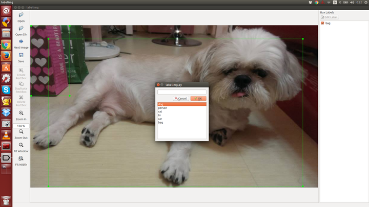

# LabelImg

LabelImg is a graphical image annotation tool. The source mainly comes from [labelme](labelme.csail.mit.edu).

It is written in Python and uses Qt for its graphical interface.

The annotation file will be saved as a XML file. The annotation format is PASCAL VOC format, and the format is the same as [ImageNet](http://www.image-net.org/)

## Dependencies
Requires at least [Python 2.6](http://www.python.org/getit/) and has been tested with [PyQt
4.8](http://www.riverbankcomputing.co.uk/software/pyqt/intro).

In order to build the resource and assets, you need to install pyqt4-dev-tools:

`$ sudo apt-get install pyqt4-dev-tools`

## Usage
After cloning the code, you should run `make all` to generate the resource file.

You can then start annotating by running `./labelImg.py`. For usage
instructions you can see [Here](https://youtu.be/p0nR2YsCY_U)

At the moment annotations are saved as a XML file. The format is PASCAL VOC format, and the format is the same as [ImageNet](http://www.image-net.org/)

You can also see [ImageNet Utils](https://github.com/tzutalin/ImageNet_Utils) to download image, create a label text for machine learning, etc

### Create pre-defined classes

You can edit the [data/predefined_classes.txt](https://github.com/tzutalin/labelImg/blob/master/data/predefined_classes.txt) to load pre-defined classes

### General steps from scratch

* Build and launch. `make all; python labelImg.py`

* Click 'Change default saved annotation folder' in Menu/File

* Click 'Open Dir'

* Click 'Create RectBox'

The annotation will be saved to the folder you specifiy

### Hotkeys

* Ctrl + r : Change the defult target dir which saving annotation files

* Ctrl + n : Create a bounding box

* Ctrl + s : Save

* n : Next image

* p : Previou image
