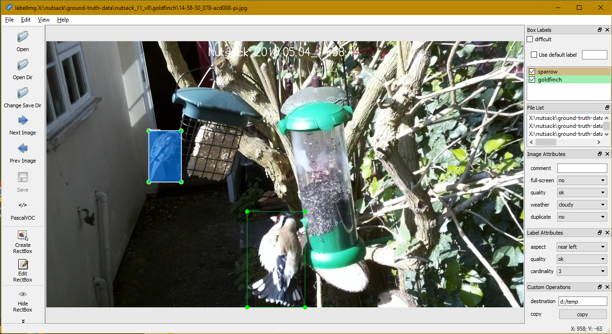

LabelImg - Custom Attributes Widgets
====================================

Custom Attributes Widgets

These allow additional detail to be stored within the standard PASCAL VOC xml format.

They are specified in three scopes (image, label, and global) within the file "customAttributes.py".

Image and label attributes are simply read from and written to the PASCAL VOC files, however global attributes widgets can be used to implement custom workflow logic.


The following screenshot shows the screen impact, and following is an example of the xml that is generated.



     
```xml
    <annotation>
        <folder>goldfinch</folder>
        <filename>14-58-50_078-acd008-pi.jpg</filename>
        <path>X:\nutsack\ground-truth-data\nutsack_11_v8\goldfinch\14-58-50_078-acd008-pi.jpg</path>
        <source>
            <database>Unknown</database>
        </source>
        <size>
            <width>1920</width>
            <height>1072</height>
            <depth>3</depth>
        </size>
        <segmented>0</segmented>
        <attributes>
            <attribute key="weather">cloudy</attribute>
            <attribute key="quality">ok</attribute>
            <attribute key="full-screen">no</attribute>
            <attribute key="duplicate">no</attribute>
        </attributes>
        <object>
            <name>sparrow</name>
            <pose>Unspecified</pose>
            <truncated>0</truncated>
            <difficult>0</difficult>
            <attributes>
                <attribute key="aspect">rear left</attribute>
                <attribute key="quality">ok</attribute>
                <attribute key="cardinality">3</attribute>
            </attributes>
            <bndbox>
                <xmin>413</xmin>
                <ymin>361</ymin>
                <xmax>543</xmax>
                <ymax>567</ymax>
            </bndbox>
        </object>
        <object>
            <name>goldfinch</name>
            <pose>Unspecified</pose>
            <truncated>1</truncated>
            <difficult>0</difficult>
            <attributes>
                <attribute key="aspect">rear right</attribute>
                <attribute key="quality">ok</attribute>
                <attribute key="cardinality">3</attribute>
            </attributes>
            <bndbox>
                <xmin>808</xmin>
                <ymin>686</ymin>
                <xmax>1041</xmax>
                <ymax>1072</ymax>
            </bndbox>
        </object>
    </annotation>
```

Custom Workflow Logic
~~~~~~~~~~~~~~~~~~~~~

I have several cameras producing thousands of images every day.
My current latest object detection model is classifying the images and producing a PASCAL VOC file for each classified image.
Each file contains the inferred boxes, and additionally a confidence score (this also needs to be displayed in the UI).

I want to harvest the "error" images AND a PASCAL VOC file and route them to the next training set (once a week since you ask).
By "error" images I mean ones that will be good for training because the boxes and scores are wrong.

But I really don't care about any of the other images - they may never get looked at again!
And the default auto-save mode is not required (although I also don't care about the files it may produce).

So I enter the directory where I want to collect my "error" output, and the "next" through the images, and when I see one I want I can press the copy button.

This has massively improved my "labelling" productivity.
